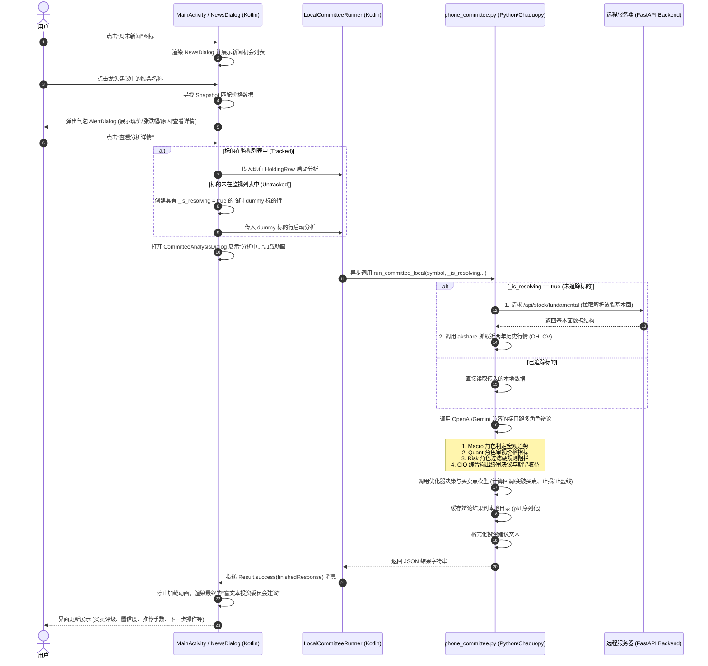

# openInvest

自部署的 AI 投资委员会、新闻机会发现、盘中监控和量化回测工具。

openInvest 的目标不是替你下单，而是把投资决策过程变得可追踪、可复盘、可验证：多角色 LLM 独立讨论标的，确定性模型负责仓位约束、风险控制和执行条件，本地账本记录真实账户与委员会影子账户的差异。

本项目仅用于研究、复盘和个人决策辅助，不构成投资建议。

## 当前能力

- 多角色投资委员会：Macro Strategist、Quant Analyst、Risk Officer、CIO 输出 BUY / ACCUMULATE / HOLD / TRIM / SELL。
- 国内热门新闻发现：抓取国内新闻源和热榜，不限于股票新闻，提炼事件、A 股板块、主题和候选龙头股。
- 风险新闻量化：对地缘冲突、制裁、供应链、政策、宏观冲击等明显危险信息，输出可解释的 A 股影响估计。
- 双账户账本：`real` 只记录用户明确告知的真实成交，`committee` 按委员会建议做影子执行。
- 盘中监控：拉取行情，跑持仓和自选标的委员会，过滤不可执行提醒，拦截涨停追买和重复同向影子交易。
- 买卖点模型：计算回调买点、突破买点、止损、止盈、减仓、再入场、CVaR、ATR、收益风险比。
- SMC 回测：支持 swing、BOS/CHOCH、FVG、流动性 sweep、ATR 止损、RR 止盈，A 股默认只做多。
- PnL 快照：按日记录真实账户和委员会账户的收盘后盈亏，并生成基准对比图。
- 独立桌面窗口：实时展示标的状态、买卖准则、出场点、评分、推荐手数、现金占比、持仓手数、日度选股和周末新闻机会。
- 交易模式：桌面窗口可切换主动盈利、现金回收、主动避险，改变提醒优化层的现金保留和买卖执行门槛。
- 可选 Web/API：保留委员会、账户、PnL、SMC 回测、系统规则、历史决策、数据源健康等接口，主要用于调试和外部集成。

## 数据源

项目行情与外部宏观信息获取已全部收拢于统一中间层 `utils.market_data_provider`，方便后续切换数据源。

当前行情和新闻入口：

- **行情分发中间层**：`utils.market_data_provider` 提供统一的价格拉取（`fetch_prices`）、历史行情获取（`get_history_data`）以及标的代码检索（`search_symbols`）等接口。
- **实时行情**：A 股及港股通过新浪行情直接提取。
- **历史行情路由**：A 股自动调用 `utils.akshare_data`（新浪源）；全球/美股/外汇等资产走 `utils.exchange_fee`（yfinance 源）。
- **标的检索**：`utils.market_data_provider.search_symbols`（通过 `akshare` 检索）。
- **宏观快照及数据**：`utils.market_data_provider.get_macro_snapshot` 统一聚合国内宏观数据（上证指数、北向资金、在岸人民币汇率、10年期国债收益率），支持传入 `as_of_date` 拦截历史数据以防止回测中发生数据穿越。
- **新闻**：国内新闻聚合、热榜、RSS、DDGS/web search。
- **symbol 相关新闻**：`services.news_sources.symbol_news`，通过通用 web/news search 获取，不依赖行情包。

历史配置里仍可能出现字段名 `yfinance_proxy`。这是旧 schema 的兼容字段，用于表示行情代理 symbol，例如黄金用 `GC=F` 和 `USDCNY=X` 反推人民币克价；它不是包依赖。

## 目录结构

```text
agents/       LLM 角色 prompt 和 SDK agent 封装
backend/      盘中监控使用的直接委员会 API
connectors/   GUI/API 桥、浏览器侧接口
core/         委员会编排、优化器、买卖点、SMC 回测
db/           SQLite 账本：账户、交易、insights、events、行情缓存
jobs/         盘中监控、周末新闻、PnL 快照等任务
services/     新闻源、国内热榜增强、通知服务
scripts/      CLI、回测、诊断、验证工具
docs/         Wiki、ADR、API 和基准说明
tests/        单元测试和回归测试
```

## 快速开始

要求：

- Python `3.13+`
- `uv`
- 建议安装 Playwright Chromium，用于国内新闻源抓取

安装：

```powershell
git clone https://github.com/longsizhuo/openInvest.git
cd openInvest
uv sync
uv run playwright install chromium
Copy-Item .env.example .env
```

编辑 `.env`，至少配置一个 OpenAI 兼容 LLM：

```env
LLM_API_KEY=
LLM_BASE_URL=https://api.deepseek.com
LLM_MODEL=deepseek-v4-flash
```

旧的 `DEEPSEEK_*` 变量仍然兼容，但推荐使用新的 `LLM_*`。

## 本地敏感文件

不要提交这些文件或目录：

```text
.env
jobs/market_monitor_config.json
data/
logs/
backend.log
backend_err.log
*.db
```

`jobs/market_monitor_config.example.json` 是盘中监控配置模板。真实的 `jobs/market_monitor_config.json` 可能包含现金、持仓、自选股和账户同步设置，必须留在本地。

交易模式字段在本地配置中为：

```json
"trading_mode": "active_profit"
```

可选值：`active_profit`（主动盈利，默认）、`cash_recovery`（现金回收，保留更多现金并优先释放风险/现金）、`risk_off`（主动避险，提高买入门槛、压缩买入手数并强化纪律卖出）。模式只作用于 `jobs/market_monitor_alerts.py` 的提醒优化层，不改变委员会原始结论字段。

## 运行入口

推荐直接双击 Windows 启动脚本：

```powershell
.\start-invest-backend.bat
```

默认启动内容：

- 停止同一项目目录下残留的旧 OpenInvest 进程，避免日志文件或窗口被占用。
- 启动 `jobs.market_monitor`，由委员会任务、日度选股任务和周末新闻任务写入本地快照。
- 启动 `scheduler.runner`，负责交易日 11:30 和 15:00 日度选股及其他定时任务。
- 打开独立桌面监控窗口，不再默认打开网页预览。
- 跳过可选 HTTP 后端，窗口通过本地快照文件和 Python 直接调用通信。

桌面窗口现金栏可点击修正可用现金和 T+2 待交收资金；修正会先写 `AccountLedger(real)`，再由账本同步 `jobs/market_monitor_config.json` 和 `data/market_monitor/latest_window.json`。

关闭桌面主窗口时，会同步停止同一项目目录下由启动脚本拉起的 `jobs.market_monitor`、`scheduler.runner`、周末新闻和日度选股后台任务，避免窗口关闭后继续抓新闻或跑选股。

可移植环境变量：

```powershell
$env:OPENINVEST_ROOT="D:\path\to\OpenInvest"
$env:OPENINVEST_PYTHON="D:\path\to\OpenInvest\.venv\Scripts\python.exe"
$env:OPENINVEST_UV="uv"
$env:OPENINVEST_LOG_DIR="logs"
$env:OPENINVEST_RESTART_EXISTING="1"
$env:OPENINVEST_START_WINDOW="1"
```

脚本参数：

```powershell
.\start-invest-backend.bat --no-window
.\start-invest-backend.bat --no-restart
.\start-invest-backend.bat --with-backend --port 8766
```

手动启动桌面窗口：

```powershell
uv run python -m scripts.launch_monitor_window
```

可选启动 GUI/API 桥，默认端口 `8765`：

```powershell
uv run uvicorn connectors.web_api:app --host 127.0.0.1 --port 8765
```

可选启动兼容 HTTP 后端，例如需要外部工具调用 `backend.server` 时：

```powershell
uv run uvicorn backend.server:app --host 127.0.0.1 --port 8766
```

正常桌面窗口和周末新闻流程不依赖 `8766`。`jobs.market_monitor`、`jobs.weekend_news_crawl` 和窗口内单标的委员会分析优先使用 Python 直接调用。

运行盘中监控：

```powershell
uv run python -m jobs.market_monitor
```

运行周末或非交易时段国内新闻机会发现：

```powershell
uv run python -m jobs.weekend_news_crawl
```

生成或刷新 PnL 快照：

```powershell
uv run python -m jobs.pnl_snapshot
```

## 关键接口

可选直接后端，示例 `http://127.0.0.1:8766`：

- `POST /api/committee`：对单个标的运行投资委员会。
- `GET /api/accounts`：查看真实账户和委员会账户。
- `GET /api/accounts/trades`：查看账户交易流水。
- `POST /api/accounts/real/trades`：记录用户明确执行的真实成交。
- `POST /api/accounts/snapshot`：写入日度收盘 PnL 快照。
- `GET /api/accounts/pnl`：查看账户 PnL 历史。

可选 GUI/API 桥，默认 `http://127.0.0.1:8765`：

- `POST /api/committee/run`：运行 GUI 使用的委员会任务。
- `GET /api/committee/{task_id}`：轮询委员会任务状态。
- `GET /api/committee_sessions`：查看历史委员会记录。
- `GET /api/symbols/search`：通过 akshare 搜索 A 股代码和名称。
- `POST /api/backtest/smc`：运行 SMC 策略回测。
- `GET /api/accounts`、`GET /api/accounts/pnl`：账户与 PnL 视图。
- `GET /api/data_sources/health`：查看行情、黄金、邮件、PnL、SQLite 缓存等数据源状态。
- `GET /api/regime_rules`：查看硬规则、角色 prompt 和系统工具元数据。

## CLI 示例

SMC 回测：

```powershell
uv run python -m scripts.backtest_smc 300001 --period 2y
uv run python -m scripts.backtest_smc 600150 --period 1y --risk 0.5 --json
```

SMC 默认 `allow_short=False`，符合普通 A 股交易约束。只有研究可做空市场时才使用 `--allow-short`。

常用测试：

```powershell
uv run pytest tests/test_smc_backtest.py -q
uv run pytest tests/test_account_ledger.py tests/test_market_monitor_entry_exit_alerts.py -q
uv run pytest tests/test_news_sources.py -q
uv run pytest tests/test_gold_price.py tests/test_backtest_no_lookahead.py tests/test_quotes.py tests/test_fx.py tests/test_web_api.py -q
```

## 决策流程

1. 收集行情、基本面、宏观环境、国内新闻和组合状态。
2. 委员会角色独立输出观点，CIO 生成 memo。
3. 确定性优化器根据现金、手数、regime、概率、基本面和风控约束修正仓位。
4. 买卖点模型附加回调买点、突破买点、止损、止盈、减仓和再入场价格。
5. 可选的 LLM 审核只评价优化器结果，不重新编造价格和仓位。
6. 执行护栏拦截涨停追买、重复同向影子交易、低质量或不可执行提醒。
7. 委员会账户记录系统会怎么做，真实账户只在用户明确录入成交后变化。

### A 股持仓止盈止损与卖出提醒

已持仓 A 股使用独立的 `position_exit_plan`，锚定真实成本和板块级周度回测参数。它和入场/出场点模型不是一回事：

- `entry_exit_points` 用于判断现在是否适合买入、加仓、回踩或突破。
- `position_exit_plan` 用于已有持仓后的纪律止损、第一止盈、第二止盈和收盘后追踪止损上移。
- 盘中 10 分钟委员会刷新不会重算并下移持仓止盈止损线；A 股收盘后才允许追踪止损按规则上移。
- 主窗口如果显示“候选卖”，表示委员会方向是减仓/卖出，但价格还没有触发锁定的持仓纪律线，或提醒层没有把它选成可执行操作。
- `TRIM` 分两类：`stop_loss/bearish/risk/drawdown/exit_policy` 是风控型减仓，不要求买回点；`range_trade/take_profit_reentry/swing` 是战术型高抛低接，必须给低于现价的买回点，否则降级 `HOLD`。
- 已触发持仓纪律线的卖出提醒会用板块策略质量、Wilson 胜率下界、保守卖出期望和卖出后路径效用调整提醒阈值，避免该卖时被普通观察状态淹没。
- 委员会给 `HOLD` 时，如果已持仓 A 股连续触发止盈/减仓线或即时触发止损线，提醒层会生成 `position_exit_discipline_review` 纪律复核候选：用“卖出期望 - 继续持有证据 - 交易摩擦”做净效用比较。止盈止损参数本身来自历史回测，因此会乘以 `sell_reliability`、`sell_win_rate_lower` 和卖出后路径优势下界，不能把价格线当成 100% 正确的机械卖点。
- 未触发纪律线但委员会给出强 `SELL/TRIM` 时，提醒层会额外评估持仓风险释放：委员会置信度、建议卖出金额占持仓比例、保守卖出胜率、卖出后路径效用和当日走弱程度共同决定是否进入 `需要操作`。
- 每周止盈止损优化默认回看最近 62 天，同步写入 `sell_utility_adjustment_pct`、`sell_reliability` 和 `sell_evidence_score`。这些参数用 Wilson 下界和样本收缩得到，只影响已有持仓的确定性卖出效用，不改变入场点，也不新增/删除 App 接口字段。
- 板块参数按东方财富行业优先，实时源只返回部分标的时会继续用 `data/sector_cache.json` 和本地配置补齐；单票或卖出路径样本偏少的板块会标记 `sample_quality=thin/sparse` 并收缩卖出效用，降低过拟合。
- 盘中监控启动后会读取 `data/sector_cache.json`，对 A 股标的用东方财富板块覆盖运行时 `sector`，并保留原配置为 `config_sector`。这样委员会上下文、`position_exit_plan` 参数读取、告警板块分布和窗口展示都使用与周更优化一致的板块名。

诊断卖出阈值是否过严：

```powershell
uv run python scripts/diagnose_ashare_sell_threshold.py --symbols "600183,002185,601138" --days 120 --bands "1.00,1.01,1.03,1.05,1.08"
```

诊断报告写入 `reports/ashare_sell_threshold_diagnosis.json`，重点看 `decision_utility`、`max_drawdown_pct`、`sell_win_rate_lower` 和 `avg_net_sell_path_edge_pct`。`avg_net_sell_path_edge_pct = 卖出后规避回撤 - 卖出后错过反弹`，用于识别卖点是否过早。如果不同卖出带结果几乎一致，说明真正瓶颈通常在提醒筛选、止盈止损参数或 UI 状态解释，而不是委员会卖出带宽。

## 桌面监控窗口

桌面窗口读取 `data/market_monitor/latest_window.json`、`data/daily_stock_selection/latest.json` 和 `data/weekend_news/` 下的最新结果。它不再按秒重新跑业务逻辑，只在委员会、选股或新闻任务写入新快照后局部刷新界面。

主窗口只展示标的监控，多个标的按操作优先级用卡片堆叠展示：

- `需要操作`、`触发确认`、`单轮触发` 优先于普通观察。
- `候选卖/候选买` 表示委员会有方向，但尚未满足可执行价格触发或提醒层综合阈值。
- `止盈复核/止损复核` 表示持仓纪律线已经触发，但系统正在比较纪律卖出胜率、卖出后路径优势和继续持有证据；净效用转正并通过确认后才显示具体“止盈卖N手/止损卖N手”。
- 双击单个标的会立即拉取最新价格并跑一次委员会分析；分析完成后会同步更新主窗口卡片、排序、最后更新时间和 `latest_window.json`，不再只作为弹窗里的临时预览。
- 详情弹窗按信息优先级着色：高风险、止损、负预期、卖出压力红色加粗；正向证据、通过、胜率、优势绿色加粗；背景和辅助说明灰色显示。该着色只影响桌面窗口，不改变 App/API 返回 JSON。
- 买入 / 卖出建议以整数手展示，用户可在推荐上限内修改手数。
- 点击“我已遵循买入/卖出”会即时拉取最新价格记账，不使用窗口缓存价格。
- 右下角 `+` 按钮会打开手动交易面板，列出持仓和关注标的；每行可切换买/卖、调整手数并点击执行，成交按最新价格写入真实账户。
- 底部展示日度选股结果；点击候选标的会弹出悬浮详情，说明入选原因，并可加入关注列表。
- 周末新闻通过主窗口按钮打开，以相同风格的悬浮卡片展示，按影响力排序。
- 周末新闻旧版 Windows 弹框默认关闭；只有显式设置 `INVEST_WEEKEND_NEWS_POPUP=1` 才会恢复。

窗口状态字段尽量使用通俗中文：收益路径表示“1/5/20 日可能涨跌范围”，风险提示表示“ATR 波动、下行风险和防守惩罚”，校准信息表示“历史相似样本命中率和样本数量”。

## 移动客户端 (Android App)

项目提供了一个现代化的 Android 移动客户端（位于 `app/` 目录），其核心特点与流程如下：

### 核心功能
- **同步服务器配置**：支持从远程服务器一键同步/同步云端或备份上传本地的持仓、自选列表与每周止盈参数配置。
- **周末新闻机会标的互动**：在“周末新闻与机会”中，标的建议的龙头股名称可点击，点击后弹出悬浮气泡，展示当前价格、今日涨跌（如已在监视列表中）或研判原因。
- **移动端本地 AI 投委会辩论**：点击气泡或详情中的“查看分析详情”，对未追踪的股票会自动通过网络接口解析 symbol，并在手机本地的 Chaquopy Python 环境下调用 LLM（Gemini/DeepSeek）异步执行多角色辩论与优化仓位策略。
- **后台悬浮信号岛**：自动刷新服务在 App 退到后台后可显示系统悬浮窗，分析中展示进度，出现买卖信号时以紧凑卡片提醒；需要 Android 悬浮窗权限，可在设置中关闭。
- **交易模式同步**：App 设置中的 `主动盈利 / 现金回收 / 主动避险` 会传入手机本地 `run_committee_local`，影响委员会提示语和提醒优化口径；旧版调用不传该参数时默认 `active_profit`。
- **账户划转动画**：支持 A 股/港股 T+2 待交收资金一键确认可用，并伴随流畅的划转与可用金额递增计数动画，自动更新本地持仓配置及同步云端。
- **选股推荐底栏**：以白底阴影精美卡片（`Card`）和薄边框形式融入整体视觉设计，并使用红/橙/灰状态点标识推荐个股的分值高低（$\ge 80$ 分为红，$\ge 60$ 分为橙）。

### 编译与安装步骤
1. **编译环境**：需要 Android SDK 以及 JDK 17 (推荐使用 Android Studio 的 `jbr` 目录)。
2. **执行编译**（在 `app/` 目录下运行）：
   ```powershell
   $env:JAVA_HOME="D:\Program Files\Android Studio\jbr"
   .\gradlew.bat assembleDebug
   ```
3. **部署安装**（确保手机 USB 调试已开启且通过 `adb devices` 识别）：
   ```powershell
   & "C:\Users\f1993\AppData\Local\Android\Sdk\platform-tools\adb.exe" install -r app\build\outputs\apk\debug\app-debug.apk
   ```

### 业务时序流程 (Sequence Diagram)
在“周末新闻与机会”中，用户点击龙头股票名，启动本地 Chaquopy 异步分析与多角色投委会辩论的完整时序图如下：



## 双账户账本

`db/account_ledger.py` 维护两个账户：

| 账户 | 可信来源 | 更新方式 |
| --- | --- | --- |
| `real` | 用户明确告知的真实成交 | `apply_user_trade` 和 `/api/accounts/real/trades` |
| `committee` | 委员会影子执行 | `apply_committee_result` |

`sync_real_account_from_config` 只用于初始化和刷新元数据，不会覆盖已有真实账户的股数、均价或现金。这样可以长期比较：委员会指标是否真的优于用户真实执行。

当前真实持仓的单一可信源是 `AccountLedger` 的 `real` 账户：

- 桌面窗口“我已遵循买入/卖出”、手动交易面板、加入/取消关注和 `/api/accounts/real/trades` 都先写 ledger。
- 默认生产 ledger 写入后会立刻同步 `jobs/market_monitor_config.json` 和 `data/market_monitor/latest_window.json`，让旧配置读取路径和主窗口快照跟账本保持一致。
- 临时测试账本或工具脚本自定义 DB 路径时不会同步真实配置，避免测试数据污染本地持仓。
- 盘中监控每个标的一次委员会调用会同时传入 `real` 和 `committee` 的账户上下文，分别得到两套独立评估；窗口和 HTTP `/api/committee` 只展示真实账户结果，影子账户结果只用于 `committee` 账本自动执行和后续胜率复盘。

## 新闻机会发现

`jobs.weekend_news_crawl` 的目标是寻找下一个可能的热门股票，而不是只评估当前持仓。它会：

- 读取 `data/weekend_news/` 下的新闻缓存；
- 合并国内热榜、新闻源和 RSS；
- 调用 LLM 提炼 A 股板块、主题、催化和候选龙头；
- 输出机会列表和需要委员会复核的标的；
- 运行结束后写入本地结果，由桌面窗口的周末新闻悬浮卡片展示。

默认不会再弹出独立 Windows 消息框，避免和主窗口的稳定展示重复。

## 日度选股

交易日选股任务在 11:30 和 15:00 运行，以天为单位寻找 A 股热门板块和候选标的。两次任务都会写入 `data/daily_stock_selection/latest.json`，主窗口会在文件更新后刷新底部选股按钮。模型会综合：

- 国内新闻主题和事件催化；
- 板块大资金流向；
- 板块内部个股的基本面和技术面；
- 1/5/20 日收益路径分布、ATR 风险、防守惩罚和历史相似样本命中率；
- 账户现金约束，过滤资金不足以买入一手的标的。

结果写入 `data/daily_stock_selection/latest.json`，桌面窗口底部以按钮展示候选标的。点击按钮会打开悬浮详情，展示为什么入选、什么位置更适合买入、风险在哪里，以及是否值得加入关注列表。

风险新闻量化是辅助判断模型，不是收益承诺。

## 回测和研究边界

回测只能说明某组规则在历史 OHLCV 上会如何运行，不能证明未来盈利。

已知限制：

- LLM 委员会回测可能受到模型训练数据截止日影响，存在知识层面的 lookahead。
- SMC 回测避免 K 线前视偏差，但仍是对 SMC 概念的简化实现。
- 盘中提醒依赖行情可用性和本地配置质量。
- A 股真实执行还受手数、T+1、涨跌停、停牌和流动性约束，需要人工复核。

## 文档

- 架构：`docs/wiki/01-architecture.md`
- 角色：`docs/wiki/02-agents.md`
- 执行路径：`docs/wiki/04-execution-paths.md`
- 数据模型：`docs/wiki/05-data-model.md`
- API：`docs/wiki/06-api.md`
- 故障排查：`docs/wiki/09-troubleshooting.md`
- ADR：`docs/wiki/adr/`

## 免责声明

openInvest 是 LLM 驱动的研究和决策辅助工具。它可能出错、过期、过度自信或遗漏信息。它不提供金融、法律或税务建议。

所有投资决策和交易指令都由你负责。历史表现、回测结果、模型评分和 PnL 曲线都不代表未来收益。
